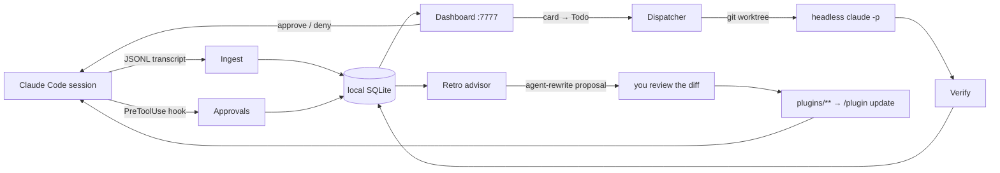

<div align="center">

# SW◆RMERY

**Run your Claude Code agents like a fleet — not like a pile of terminal tabs.**

A local-first control plane for Claude Code sessions, plus a versioned plugin marketplace
that ships one shared agent framework to every project on your machine.

[](LICENSE)
[](https://github.com/atretyak1985/swarmery/actions/workflows/ci.yml)
[](https://github.com/atretyak1985/swarmery/actions/workflows/swarmery-ci.yml)


</div>

---

## The 60-second version

You open five Claude Code sessions across three repos. One is waiting on a permission prompt
you never saw. One burned $20 re-running the same failing test. One finished an hour ago.
You find out by cycling through terminal tabs.

Swarmery gives that fleet a single window — and then closes the loop:

| | |
|---|---|
| 👁 **See everything** | Every session across every project, live: tool calls, diffs, cost, sub-agents, errors. |
| ⏱ **Stop being the bottleneck** | Approve or deny permission prompts from one queue — the deck shows exactly how much of your day went to waiting, and lets you turn a recurring prompt into an auto-approve rule. |
| 🤖 **Delegate, don't babysit** | Drag a card to **Todo** and the daemon runs a headless agent in its own git worktree, verifies the result, and moves the card to review. |
| 📈 **Improve the system, not the prompt** | Per-agent scorecards, a rule-based advisor, and agent-rewrite proposals you review as a diff. |
| 📦 **Ship agents once** | A real Claude Code marketplace: `core` + opt-in domain packs, semver'd, adopted with `/plugin update`. No more copy-pasting `.claude/` between repos. |

Everything runs on your machine: one Go binary, an embedded React SPA, a local SQLite index.
**No cloud, no account, no telemetry** — the daemon binds to `127.0.0.1` by default and your
transcripts never leave the box.

Built for people who run **many projects — often for different clients — on one machine**:
each project keeps its own isolated workspace and config, while shared agents live in one place.

---

## Quickstart

**Prerequisites:** git, Go ≥ 1.25 (older Go auto-downloads the pinned toolchain), Node ≥ 22,
and the `claude` CLI.

### 1 — Build and serve the control plane

```bash
git clone https://github.com/atretyak1985/swarmery.git
cd swarmery
bash scripts/install-swarmery.sh          # build the single embedded binary
./tools/swarmery/swarmery serve           # listens on :7777
```

```bash
curl -s http://localhost:7777/api/health  # → {"status":"ok",…}
open http://localhost:7777
```

Sessions you have already run show up immediately — the daemon backfills from the JSONL
transcripts Claude Code already writes under `~/.claude/projects/`. Nothing to instrument.

On macOS, `swarmery install` registers a launchd service so the daemon starts with your machine.

### 2 — Onboard a project

From any repo, one idempotent command writes its `.claude/` config and carves a workspace
namespace:

```bash
cd /path/to/your/project
swarmery onboard <project-slug> [pack ...]
#   packs: web-pack | iot-pack | uav-pack | infra-pack | lsp-pack
#          claude-eng-pack | graphify-pack | architecture-pack
```

The binary lives at `<swarmery>/tools/swarmery/swarmery` — put it on `PATH`, run
`swarmery install` (macOS), or call it by full path. Then open a fresh Claude Code session,
accept the `swarmery` marketplace trust prompt, and the project is live in the dashboard.
(`scripts/init.sh` is the pure-bash twin of this command.)

Work artifacts — plans, task dirs, retrospectives — land under `$HOME/swarmery-workspace`
by default; point it anywhere with `SWARMERY_WORKSPACE_ROOT` (daemon) / `AGENT_WORKSPACE_ROOT`
(plugins).

### 3 — Route permission prompts to the dashboard (optional)

```bash
swarmery hooks install       # installs the PreToolUse / Stop hook shim
```

Now every permission request and `AskUserQuestion` appears in the **Approvals** queue with the
full context, wherever you are. The shim is **fail-open**: if the daemon is down it exits
silently and Claude Code prompts you in the terminal as usual.

<details>
<summary><b>Enable the in-dashboard “＋ new project” button</b></summary>

Writing `.claude/` into an arbitrary path is opt-in, so the onboarding endpoint stays disabled
until you allow-list the parent directories it may write under:

```bash
SWARMERY_ONBOARD_ROOTS="$HOME/projects" ./tools/swarmery/swarmery serve
# persist it into the launchd service (macOS):
./tools/swarmery/swarmery install --onboard-roots "$HOME/projects"
```

Without it the button (and `POST /api/projects/onboard`) return `403 onboarding is disabled`.
The CLI `swarmery onboard` always works.

</details>

---

## The dashboard

The UI has two scopes, switched in the header: **Sessions** — the fleet view across every
project — and **Projects** — a per-project workspace with its own board, plans, and terminal.

### Fleet · Command deck

The landing view answers one question: *what needs me right now?* A headline on human wait
time, per-project lanes showing when each agent was running versus blocked on you, a
tool-by-tool breakdown of where your day went (each row one click from a **stop asking**
auto-approve rule), today's session spine, and a triage rail for what is blocked or erroring.


### Fleet · Sessions

Every session, grouped by day, filterable by project and status (`working` / `done` / `error`),
live over WebSocket. Each row carries the model, a one-line summary of what the agent is
actually doing, and elapsed time.


### Fleet · Session detail — Chat · Timeline · Diffs

Open a session and you get the whole story. **Chat** replays the conversation with inline
tool-call summaries, a pending-approval banner, and a reply box that resumes the session.
**Timeline** logs every tool call with durations and pass/fail. **Diffs** aggregates every file
change as unified diffs. The right rail breaks down models, sub-agents, skills, the call tree,
and files touched; the header carries live tokens, cost, and a `Kill` switch.


### Fleet · Approvals

Every pending permission request and `AskUserQuestion` across all sessions, with the full input
expanded, per-request expiry countdowns, and inline approve / deny-with-reason / open-session.
Multi-question and multi-select prompts render as native option groups. Resolved requests drop
into a history log that records *how* they were resolved — including `answered in the terminal`.


### Fleet · Analytics

Cost, tokens, and runs over any range, pivoted by project, model, agent, or skill: a headline
with top driver and monthly projection, productivity by file type, autonomy (tool calls per
human intervention), cost per shipped task, cache-hit rate, a stacked trend, ranked breakdowns,
an agent × project cross-tab, and CSV export.


### Fleet · Retro

The self-improvement loop. Per-agent scorecards (runs, success rate, error rate, cost, p95)
compared against the previous window; a deterministic advisor that raises tracked
recommendations through `proposed → accepted → adopted → verified`; agent-rewrite proposals you
review as a diff before anything touches an agent file; and a lessons feed parsed from your
workspace retrospectives.


### Fleet · Routines

Scheduled automation — cron, webhook, or manual — with typed steps (`command`, `ai-prompt`,
`create-task`), live cron validation, enable toggles, run-on-demand, and per-routine run history.


### Fleet · System

The entire Claude config graph on the machine — agents, skills, commands, hooks, MCP servers,
overlays — across global (`~/.claude`), project (`.claude/`), and plugin-cache scopes, with
origin and scope badges, lint warnings, usage stats, content-addressed version history, and
diffs between any two versions.


### Fleet · Projects

Every project the daemon knows, with sessions, tokens, spend, last activity, enabled packs, and
whether it is swarmery-managed. Tag, archive, or detach from here.


---

### Project workspace · Overview

Switch to a project and the whole app re-scopes. The project home leads with what shipped this
week versus how often the agents had to stop and ask you, then: what is running, blocked, in
flight, or leaking stale worktrees; week-over-week deltas; where work actually sits in the
funnel; open insights; and a capability inventory of the agents, skills, commands, and hooks
this project really uses — with per-agent error rates and an autonomy badge.


### Project workspace · Board → worktree → agent

A six-column board (Triage → Todo → In Progress → In Review → Done → Archived). Moving a card
into **Todo** wakes the dispatcher: it acquires a `swarm/<task-id>` git worktree, runs a
headless `claude -p` session under the task's playbook, then hands the result to the verifier,
which grades it against the task and stamps `PASS` / `FAIL` / `INCONCLUSIVE`.


### Project workspace · Planning Mode

Describe what you want to build. A planner session asks clarifying questions in a wizard, then
writes a structured plan into your private workspace — which you can activate into board tasks.


### Project workspace · Plans

Plans are markdown on disk; this page is the control surface. Epics filtered by
Active / Done / Archived, a phase timeline with depends-on edges and per-phase progress from
acceptance-criteria checkboxes, lifecycle controls (pause / resume / archive), inline doc
editing, and run triggers for a single phase or the whole plan.


Each phase carries its own acceptance criteria, agent prompt, and — once executed — a
completion report and execution record.


### Project workspace · Playbooks

The recipe a task runs under, as a visible stage chain — which model runs `plan`, `implement`,
`verify`, `review`, and the exact prompt each stage gets. Four built-ins ship with the daemon;
`Duplicate to project` copies one into `.claude/playbooks/` to edit.


### Project workspace · Architecture

The project's architecture map (`/architecture-map` from `architecture-pack`) embedded in the
dashboard — modules by layer, named end-to-end flows, API surface — with a staleness badge that
compares the map's commit against current `HEAD`, and a one-click headless rebuild.


### Project workspace · Memory

Everything a project remembers in one editor: `CLAUDE.md`, Claude Code auto-memory, and Serena
notes. Markdown editing with preview, a versioned backup on every save, and a conflict guard if
the file changed underneath you.


### Project workspace · Terminal

A real PTY docked under the dashboard, opened in the project root or in a task's worktree — so
you can check what an agent did without leaving the page.


---

## How the loop closes



Sessions produce evidence; evidence produces recommendations; recommendations become reviewed
changes to the agents themselves; the marketplace ships those changes to every project.

---

## The plugin marketplace

The other half of the repo. Copying an agent system between projects rots fast: substitutions
pile up, files drift, every improvement has to be ported N times. Swarmery replaces that with
the native Claude Code plugin mechanism — **semver-versioned**, **namespaced** (`core:tech-lead`),
**updatable** (`/plugin update`). Projects pin a known-good version and adopt on bump.

| Plugin | What's inside |
|---|---|
| **`core`** | The vendor-neutral framework every consumer enables: 41 agents (tech-lead, implementation-agent, debugger, verification-agent, security-auditor, …), 29 skills, 16 commands, lifecycle/safety hooks, the statusline, and the project-aware `agent-work` workspace CLI. |
| `uav-pack` | UAV/drone domain: MAVLink-style telemetry, mission planning, embedded/edge runtime. |
| `iot-pack` | IoT domain: BLE communication, device telemetry, health-metrics processing. |
| `web-pack` | Web/marketing: SEO, i18n, landing-page CRO, Figma-to-code styling. |
| `infra-pack` | Infrastructure & delivery: Kubernetes/Helm, GitOps promotion, IaC, GitLab CI, cloud CI auth, Keycloak. |
| `lsp-pack` | Semantic code navigation via the Serena LSP MCP server (needs the `serena` binary). |
| `claude-eng-pack` | Claude-engineering: agent architecture, tool/MCP design, prompt engineering, Claude Code config, context reliability. |
| `graphify-pack` | `/graphify` — repo → persistent knowledge graph with query/path/affected tools (needs the `graphify` CLI). |
| `architecture-pack` | `/architecture-map` — machine-readable architecture JSON + a self-contained HTML viewer, freshness-stamped per commit. |

Every pack requires `core` and is opt-in per project.

### Consuming it

One command from the project root (details in [docs/ONBOARDING.md](docs/ONBOARDING.md)):

```bash
bash <swarmery-repo>/scripts/init.sh <project-slug> [pack ...]
```

Or by hand, in the project's `.claude/settings.json`:

```jsonc
{
  "extraKnownMarketplaces": {
    "swarmery": { "source": { "source": "github", "repo": "atretyak1985/swarmery" } }
  },
  "enabledPlugins": {
    "core@swarmery": true,
    "web-pack@swarmery": true
  },
  "env": { "AGENT_PROJECT": "your-project" }
}
```

Then drop your flavor config into `.claude/project.json` (schema in `overlays/_schema/`,
reference overlay in `overlays/example/`). Core agents, skills, and hooks read it at runtime for
repos, the main app, cloud settings, and domain terms — **nothing project-specific is ever baked
into a plugin** (policy: [docs/NEUTRALITY.md](docs/NEUTRALITY.md), enforced in CI by
`scripts/scan-flavor.sh`, which must report zero hits).

### Design rules

- **Cross-project isolation.** Enabling swarmery is additive: a project's own `.claude/agents/`
  still wins by name — that's the intended override mechanism, not a fork. Work artifacts live in
  a per-project namespace (`AGENT_WORKSPACE_ROOT` + `AGENT_PROJECT`), so clients never share
  context.
- **Framework ≠ workspace.** Plans, sessions, and task dirs live in a separate private workspace
  repo, never here.
- **Graduation rule** ([docs/EXTENDING.md](docs/EXTENDING.md)): components are born
  project-local, promoted to a domain pack when a second project needs them, then to `core` when
  every project does. **Flow goes up only.**
- **Explicit semver** in every `plugin.json`; a change pushed without a bump is a change no
  consumer will ever pull.

---

## Configuration

<details>
<summary><b>CLI reference</b></summary>

| Command | Purpose |
|---|---|
| `serve` | Run the daemon + dashboard on `:7777`. |
| `onboard` / `offboard` / `attach` | Bring a directory under swarmery (writes `.claude/`), or reverse it. |
| `hooks install\|uninstall\|status` | Install the permission/stop hook shim into Claude Code settings. |
| `hook <permission-request\|stop>` | The shim itself — invoked by Claude Code, always exits 0. |
| `console` | Interactive TUI: live event feed, y/n approvals, dispatcher pause. |
| `status` / `service-status` | Live daemon snapshot / launchd service state. |
| `install` / `uninstall` | Register or remove the launchd auto-start service (macOS). |
| `ingest` / `backfill` / `wscan` / `sysscan` | One-shot index passes (transcripts, workspace, machine config). |
| `backup` / `prune` / `recost` | Snapshot the DB (safe while serving), roll up + delete old rows, re-price sessions. |

</details>

<details>
<summary><b>Environment variables</b></summary>

| Variable | Default | Effect |
|---|---|---|
| `SWARMERY_PORT` | `7777` | Listen port. |
| `SWARMERY_PROJECTS_ROOT` | `~/.claude/projects` | Where transcripts are watched. |
| `SWARMERY_WORKSPACE_ROOT` | `~/swarmery-workspace` | Private workspace repo root (plans, tasks). |
| `SWARMERY_EXCLUDE` | `/tmp/*,/private/tmp/*` | Comma-separated project paths to ignore. |
| `SWARMERY_ONBOARD_ROOTS` | *(empty — disabled)* | Allow-list of parents the dashboard may onboard under. |
| `SWARMERY_SYSTEM_READONLY` | `0` | `1` refuses **all** config and memory writes — safe for shared machines. |
| `SWARMERY_DISPATCH` | on | `0`/`false`/`off` disables the board→agent dispatcher. |
| `SWARMERY_AUTOVERIFY` / `SWARMERY_ROUTINES` / `SWARMERY_AUTOPROVISION` | on | Kill-switches for verification, routines, pack auto-provisioning. |
| `SWARMERY_MAX_CONCURRENT` / `SWARMERY_MAX_WORKTREES` | `2` / `4` | Dispatcher concurrency and worktree ceiling. |
| `SWARMERY_DISPATCH_TIMEOUT_MIN` | `45` | Hard timeout per dispatched agent run. |
| `SWARMERY_NOTIFY_URL` / `_EVENTS` / `_TELEGRAM_CHAT` | — | Outbound webhook notifications (e.g. when an approval is waiting). |
| `SWARMERY_CLAUDE_BIN` | `claude` | Path to the Claude Code CLI the daemon spawns. |

`swarmery install` bakes any `SWARMERY_*` you have exported into the launchd plist.
Flags mirror most of these (`--port`, `--bind`, `--exclude-projects`, `--workspace-root`, …);
run `swarmery help` for the full list.

</details>

---

## Scope and limits

Stated plainly, so nothing here surprises you later:

- **Single-user, localhost-only.** The daemon binds `127.0.0.1`; mutating endpoints are guarded
  by a local-origin check. There is no authentication and no multi-user model — don't expose it.
- **Agent-level cost is not attributed.** Claude Code's transcripts don't record sub-agent
  turns, so agents and skills carry **run counts**, not dollars. Session- and project-level cost
  is exact.
- **Planning runs are in-memory.** A daemon restart forgets an in-flight planning session
  (the written plan survives — it's a file).
- **Playbooks are read + duplicate.** Visual authoring isn't built; edit the copied file.
- **Graphify artifacts are served, not built.** The daemon embeds an existing `graph.html`;
  generating it is the `graphify` CLI's job.
- **Auto-provisioning generates for `architecture-pack` only.** Other packs are install-only.
- **macOS is the first-class host.** The daemon is portable Go, but `install` /
  `service-status` are launchd-specific.

---

## Working on swarmery itself

```bash
cd tools/swarmery
make build          # snapshot docs → vite bundle → go:embed → single ./swarmery binary
make test           # go vet ./... && go test ./...
make dev            # go daemon + vite dev server (proxies /api to :7777)
make install        # rebuild + swap the launchd-managed binary (macOS)
```

Marketplace-side checks (mirrors [`ci.yml`](.github/workflows/ci.yml)):

```bash
find plugins scripts -name '*.sh' -exec bash -n {} \;      # shell syntax
bash scripts/tests/protect-sensitive-files.test.sh          # hook behaviour
bash scripts/scan-flavor.sh                                 # neutrality ratchet — must be "✓ clean"
```

Installed plugins run from `~/.claude/plugins/cache`, **not** from your checkout — test
in-progress plugin changes with `claude --plugin-dir plugins/core` (repeatable per pack).

Further reading: [docs/ONBOARDING.md](docs/ONBOARDING.md) ·
[docs/PLUGINS.md](docs/PLUGINS.md) · [docs/EXTENDING.md](docs/EXTENDING.md) ·
[docs/NEUTRALITY.md](docs/NEUTRALITY.md) · [docs/WORKFLOW.md](docs/WORKFLOW.md) ·
[control plane README](tools/swarmery/README.md) · [SECURITY.md](SECURITY.md)

---

## License

[PolyForm Noncommercial 1.0.0](LICENSE) — free for personal, educational, and open-source use;
commercial use prohibited.
