<div align="center">

# SW◆RMERY

**Run your Claude Code agents like a fleet — not like a pile of terminal tabs.**

A local-first control plane for Claude Code sessions, plus a versioned plugin marketplace
that ships one shared agent framework to every project on your machine.

[](LICENSE)
[](https://github.com/atretyak1985/swarmery/actions/workflows/ci.yml)
[](https://github.com/atretyak1985/swarmery/actions/workflows/swarmery-ci.yml)


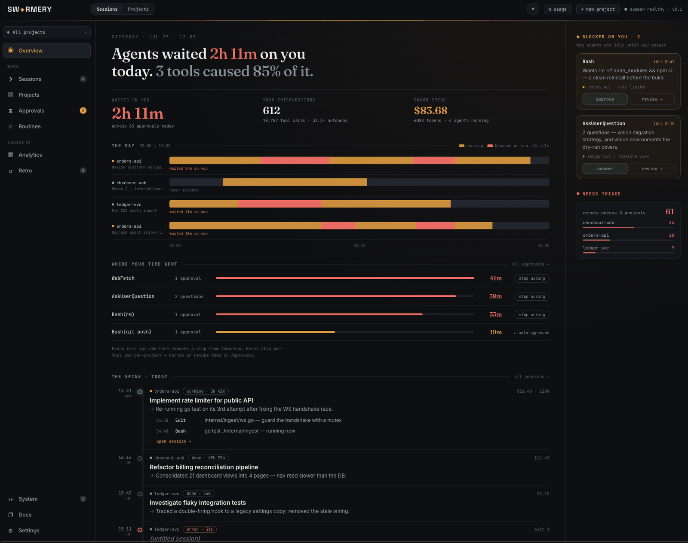

</div>

---

## The 60-second version

You open five Claude Code sessions across three repos. One is waiting on a permission prompt
you never saw. One burned $20 re-running the same failing test. One finished an hour ago.
You find out by cycling through terminal tabs.

Swarmery gives that fleet a single window — and then closes the loop:

| | |
|---|---|
| 👁 **See everything** | Every session across every project, live: tool calls, diffs, cost, sub-agents, errors. |
| ⏱ **Stop being the bottleneck** | Approve or deny permission prompts from one queue — the deck shows exactly how much of your day went to waiting, and lets you turn a recurring prompt into an auto-approve rule. |
| 🤖 **Delegate, don't babysit** | Drag a card to **Todo** and the daemon runs a headless agent in its own git worktree, verifies the result, and moves the card to review. |
| 📈 **Improve the system, not the prompt** | Per-agent scorecards, a rule-based advisor, and agent-rewrite proposals you review as a diff. |
| 📦 **Ship agents once** | A real Claude Code marketplace: `core` + opt-in domain packs, semver'd, adopted with `/plugin update`. No more copy-pasting `.claude/` between repos. |

Everything runs on your machine: one Go binary, an embedded React SPA, a local SQLite index.
**No cloud, no account, no telemetry** — the daemon binds to `127.0.0.1` by default and your
transcripts never leave the box.

Built for people who run **many projects — often for different clients — on one machine**:
each project keeps its own isolated workspace and config, while shared agents live in one place.

---

## Quickstart

**Prerequisites:** git, Go ≥ 1.25 (older Go auto-downloads the pinned toolchain), Node ≥ 22,
and the `claude` CLI.

### 1 — Build and serve the control plane

```bash
git clone https://github.com/atretyak1985/swarmery.git
cd swarmery
bash scripts/install-swarmery.sh          # build the single embedded binary
./tools/swarmery/swarmery serve           # listens on :7777
```

```bash
curl -s http://localhost:7777/api/health  # → {"status":"ok",…}
open http://localhost:7777
```

Sessions you have already run show up immediately — the daemon backfills from the JSONL
transcripts Claude Code already writes under `~/.claude/projects/`. Nothing to instrument.

On macOS, `swarmery install` registers a launchd service so the daemon starts with your machine.

### 2 — Onboard a project

From any repo, one idempotent command writes its `.claude/` config and carves a workspace
namespace:

```bash
cd /path/to/your/project
swarmery onboard <project-slug> [pack ...]
#   packs: web-pack | iot-pack | uav-pack | infra-pack | lsp-pack
#          claude-eng-pack | graphify-pack | architecture-pack
```

The binary lives at `<swarmery>/tools/swarmery/swarmery` — put it on `PATH`, run
`swarmery install` (macOS), or call it by full path. Then open a fresh Claude Code session,
accept the `swarmery` marketplace trust prompt, and the project is live in the dashboard.
(`scripts/init.sh` is the pure-bash twin of this command.)

Work artifacts — plans, task dirs, retrospectives — land under `$HOME/swarmery-workspace`
by default; point it anywhere with `SWARMERY_WORKSPACE_ROOT` (daemon) / `AGENT_WORKSPACE_ROOT`
(plugins).

### 3 — Route permission prompts to the dashboard (optional)

```bash
swarmery hooks install       # installs the PreToolUse / Stop hook shim
```

Now every permission request and `AskUserQuestion` appears in the **Approvals** queue with the
full context, wherever you are. The shim is **fail-open**: if the daemon is down it exits
silently and Claude Code prompts you in the terminal as usual.

<details>
<summary><b>Enable the in-dashboard “＋ new project” button</b></summary>

Writing `.claude/` into an arbitrary path is opt-in, so the onboarding endpoint stays disabled
until you allow-list the parent directories it may write under:

```bash
SWARMERY_ONBOARD_ROOTS="$HOME/projects" ./tools/swarmery/swarmery serve
# persist it into the launchd service (macOS):
./tools/swarmery/swarmery install --onboard-roots "$HOME/projects"
```

Without it the button (and `POST /api/projects/onboard`) return `403 onboarding is disabled`.
The CLI `swarmery onboard` always works.

</details>

---

## The dashboard

The UI has two scopes, switched in the header: **Sessions** — the fleet view across every
project — and **Projects** — a per-project workspace with its own board, plans, and terminal.

### Fleet · Command deck

The landing view is built around a number most tooling never shows you: **how long your agents
spent waiting on a human**. The hero says it outright — how much they waited today, and which
handful of tools caused most of it.

Under it, a three-cell ledger splits that time into *waited*, *auto-approved*, and *still
blocked*. Then **The day** rasterises each project into a lane of working / waiting / idle
segments, so a morning lost to one prompt nobody saw becomes a visible gap rather than a vague
feeling that things were slow.

**Where your time went** groups today's approvals by tool, and every row is one click from a
**stop asking** control that writes an auto-approve rule on the spot — the deck is both where
you notice a recurring prompt and where you kill it. Below that runs the spine of today's
notable sessions, next to a sticky rail of what is blocked on you and what is erroring.

Nothing here is a new metric pipeline: wait time is `resolvedAt − requestedAt` over permission
requests the daemon already stores (live-aged for anything still pending), and auto-approved
rows are the ones a rule resolved. On a day when nothing waited on you, the wait sections say
exactly that instead of showing a decorative zero.

<div align="center">
  <a href="docs/screenshots/overview.png"></a>
  <br><sub><i>The hero reads the whole day in one sentence; the right rail is what still needs you.</i></sub>
</div>

### Fleet · Sessions

Every session the daemon has indexed, newest first, grouped under day rules (`today · wed, jul
29`). The status chips carry live counts — `active`, `waiting`, `idle`, `done`, `killed` — and
filter client-side, so the counts keep describing the whole loaded list rather than the slice
you are currently looking at. Project scope comes from the header switcher; text search is in
the page, or `⌘K` for the global palette.

A row is a status dot, the project, the title, the model, and a chip. What makes it useful
while work is happening is the line under the title: for a live session it reads
`now: <what the agent is doing this second>`, pushed over WebSocket as events land — for a
finished one, why it ran in the first place.

The chip separates states that most dashboards flatten into one. A working session shows
elapsed time; a **stuck** one shows *quiet time* — how long the transcript has been silent —
because `working · 17 h 32 min` was a lie worth deleting. Two more chips appear only when they
have something to say: a context badge (amber past 150k tokens, red past 300k — a fat context is
the thing that quietly multiplies cost, since every turn re-reads it) and a purple **Handoff**
badge once the daemon has written a continuation brief for a session that got too heavy.

Live rows offer a graceful **Stop**; a stuck one with a confirmed-alive process gets a hard
**Kill**.

<div align="center">
  <a href="docs/screenshots/sessions.png">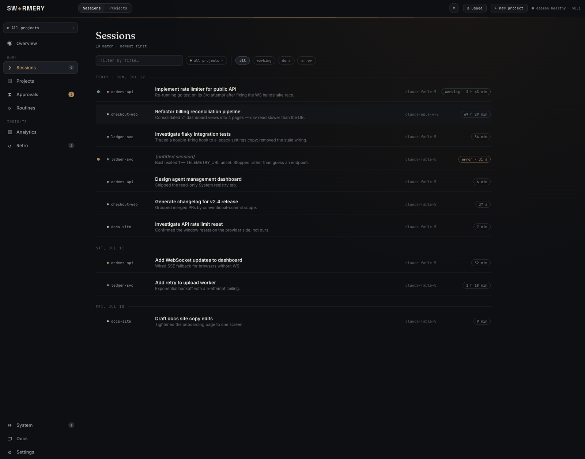</a>
  <br><sub><i>Chips filter and count, day rules group, and the <code>now:</code> line under each title updates live.</i></sub>
</div>

### Fleet · Session detail — Chat · Timeline · Diffs

Opening a session gives you the entire run in three tabs, under a header that stays pinned while
the content scrolls: live tokens, cost, error count, and the same working/quiet chip the list
speaks.

**Chat** replays the run as a conversation — your turns as bubbles, the agent's as prose. Runs of
tool activity collapse into one unobtrusive line (*"Ran 2 agents, ran 4 commands, used a tool"*)
that expands inline into the real timeline rows, nested sub-agents included. The reading order
stays human, but nothing is actually hidden. A composer at the bottom resumes the session: your
message appears immediately and reconciles against the real turn once it is ingested — and flips
to a retry affordance in place if the send died.

**Timeline** is every tool call with its duration and pass/fail. **Diffs** aggregates every file
the session touched into unified diffs with `+`/`−` counters, grouped per file.

On a wide screen the right rail turns the run into numbers without issuing a single extra
request — all of it derived from the detail already loaded: models by share of tokens, agents by
runs × duration, skills by uses, each with a bar scaled against the group's top entry. Then the
call tree of who invoked what (skills → tools → sub-agents, recursive), and every file touched
ranked by churn.

<div align="center">
  <a href="docs/screenshots/session-detail.png">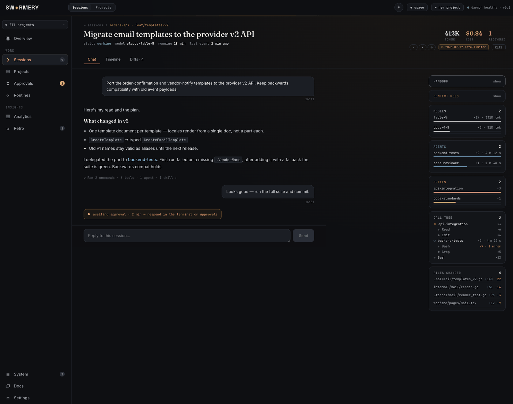</a>
  <br><sub><i>Chat keeps the run readable; the rail turns it into models, agents, skills, call tree and churn.</i></sub>
</div>

### Fleet · Approvals

Every pending permission request and `AskUserQuestion` from every session, in one queue. A card
shows the tool, the essential part of its input (expandable to the full hook payload), which
session it belongs to, how long it has been hanging, and a countdown against the 120-second
window before it expires.

Answer it in place: **Approve**, **Deny** with an optional reason, or jump into the session.
`AskUserQuestion` prompts render as what they actually are — radio groups for single-select,
checkboxes for multi-select, plus a free-text *own answer* box — rather than being flattened into
a yes/no. **Answer in the terminal** is deliberately a separate handoff rather than an approval,
because approving would mark the questions resolved without any of them ever being answered.

Resolved requests fall into a history log that records *how* each one ended — including
`answered in the terminal`, so a decision you made somewhere else doesn't read as a gap.

<div align="center">
  <a href="docs/screenshots/approvals.png">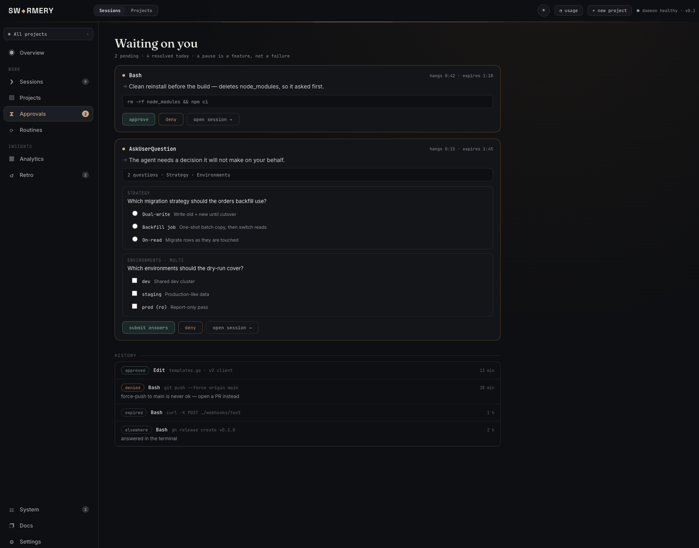</a>
  <br><sub><i>Pending cards carry the tool input, the owning session, and an expiry countdown.</i></sub>
</div>

### Fleet · Analytics

Cost, tokens, and runs over any day range. The metric switch (`$` / tokens / runs) gates what you
can pivot by, because the two come from different places: dollars and tokens pivot by **project**
or **model** and are computed from turns, while runs pivot by **agent** or **skill** and come
from events.

The headline names the top driver, the biggest mover since the previous window, and a projected
monthly figure. Under it: a stacked trend whose legend doubles as the include/exclude control
(click a series to drop it), a ranked breakdown for the current pivot, and an agents × projects
cross-tab that transposes when you flip the pivot. KPI tiles cover autonomy (tool calls per human
intervention), cost per task, cache-hit rate, and productivity by language. Everything exports to
CSV.

One honest limitation is stated in the UI rather than papered over: **agents and skills carry run
counts, not dollars.** Claude Code's transcripts don't record sub-agent turns, so a per-agent cost
figure would be invented. Session- and project-level cost is exact.

<div align="center">
  <a href="docs/screenshots/analytics.png">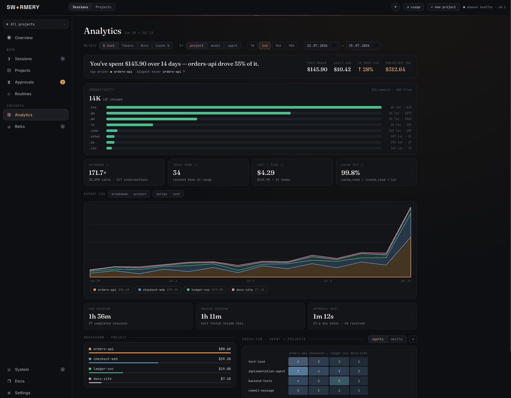</a>
  <br><sub><i>The metric switch decides the pivot; the legend is the include/exclude control.</i></sub>
</div>

### Fleet · Retro

Where the loop stops being a dashboard and starts changing the agents. Per-agent scorecards over
a range — runs, success rate, error rate, cost, p95 — each compared against the previous window,
so you see direction, not just a level. A system-health strip carries orchestrator cost and total
runs/errors above them.

The friction board is the diagnostic half: which tools got denied most (each one click from an
auto-approve rule), the top error groups, and how long approvals kept agents waiting.

Above all of it sits the advisor rail. A deterministic rule engine raises evidenced
recommendations — every one carries the data that triggered it — which you **Accept** or
**Dismiss**, and which then move through `proposed → accepted → adopted → verified` so a
suggestion can't quietly go stale in a list. `Analyze now` re-runs it on demand, and verified
recommendations keep their own history. When a recommendation implies rewriting an agent, you get
the rewrite **as a diff to review** — nothing touches an agent file unapproved. A lessons feed
parsed from your workspace retrospectives runs alongside.

<div align="center">
  <a href="docs/screenshots/retro.png">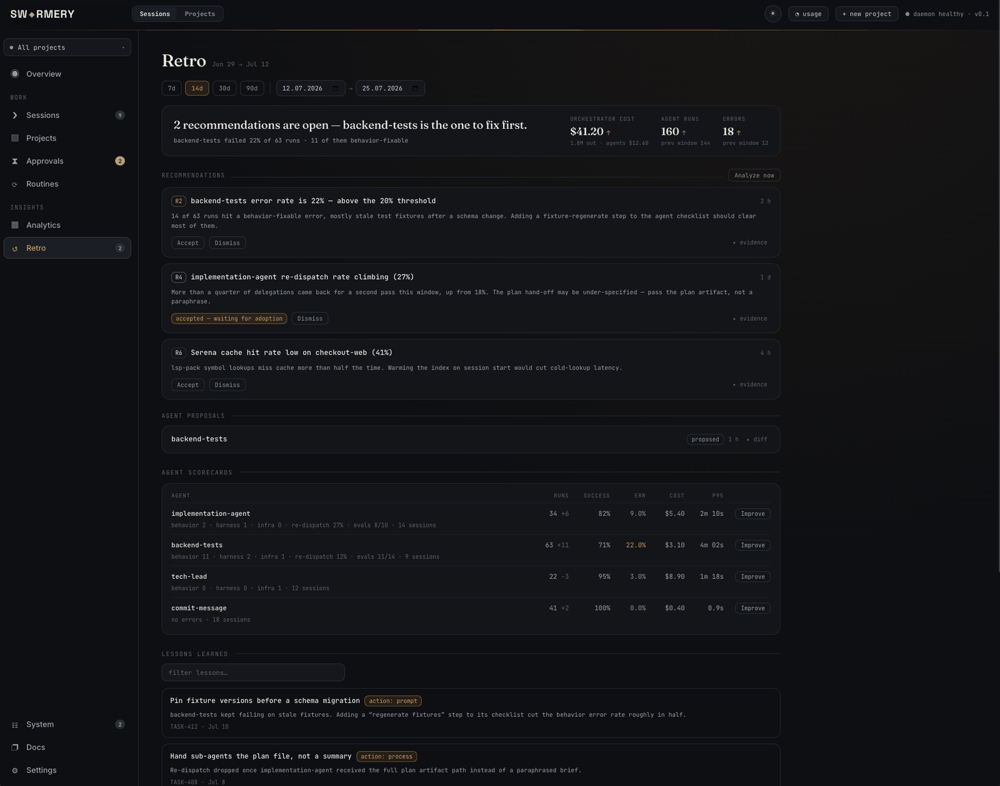</a>
  <br><sub><i>Recommendations carry their evidence and a lifecycle, so accepting one is trackable.</i></sub>
</div>

### Fleet · Routines

Scheduled automation with three triggers — cron, webhook, or manual. The list gives each routine
its scope, a human-readable rendering of its cron expression, an enable toggle, last and next run,
and a status dot for how the last one ended.

Editing happens in a drawer with a typed step builder: a step is a `command`, an `ai-prompt`, or a
`create-task`, and the cron field validates as you type. Any routine can be run on demand, and
expanding one shows its (pruned) run history. The global project scope filters the list the same
way it filters Retro and Analytics.

<div align="center">
  <a href="docs/screenshots/routines.png">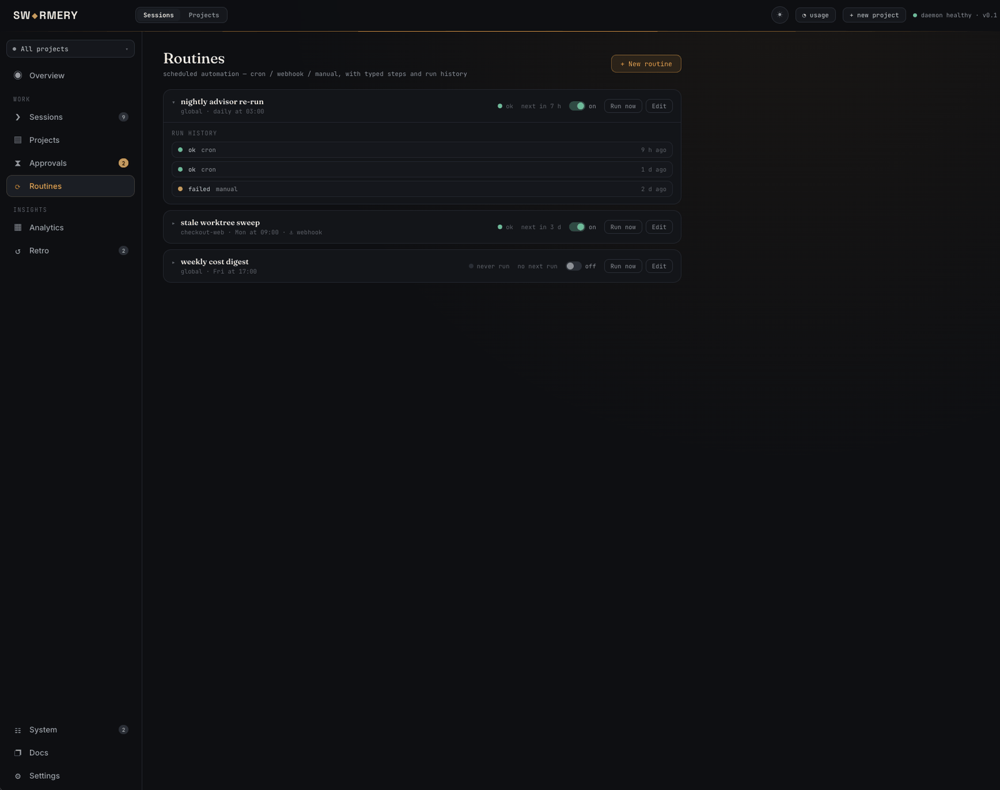</a>
  <br><sub><i>Cron, webhook or manual; steps are typed, and the schedule is rendered back in English.</i></sub>
</div>

### Fleet · System

The answer to *"which agent is actually going to run here, and where did it come from?"* — the
entire Claude config graph on the machine, across all three scopes that can define it: global
(`~/.claude`), project (`.claude/`), and the plugin cache.

Tabs for Agents, Skills, Hooks, Commands and Templates (each deep-linkable via `?tab=`), with
origin and scope badges on every item, usage stats, and lint severity badges in the header that
double as filters — click a warning count to see only what triggered it.

Because config drift is the failure mode here, every item keeps a **content-addressed version
history**: you can diff any two versions of an agent and see exactly what changed between them.
The page is live — when the daemon re-scans, the open tab refetches itself.

<div align="center">
  <a href="docs/screenshots/system.png">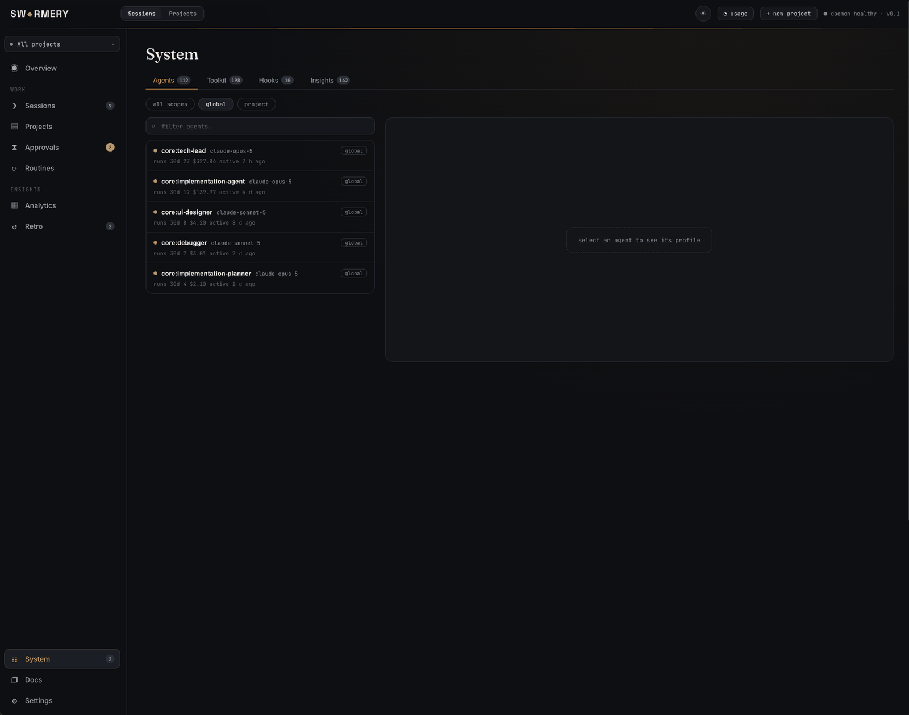</a>
  <br><sub><i>Every agent, skill, hook and command on the machine, with scope, origin and version history.</i></sub>
</div>

### Fleet · Projects

Every project the daemon knows about, split by the distinction that matters operationally:
**managed** (the swarmery plugin is enabled in its `.claude/settings.json`) versus
**telemetry-only** (sessions are indexed, but the project never opted in). Each row carries
lifetime sessions, tokens and spend, plus last activity.

Pinned projects sort first and every row has a pin toggle; tags are editable inline and the chip
row filters by them. Row actions cover archive, restore, detach and tagging. Below the list, a
week-over-week health table compares each project against its own previous week.

<div align="center">
  <a href="docs/screenshots/projects.png">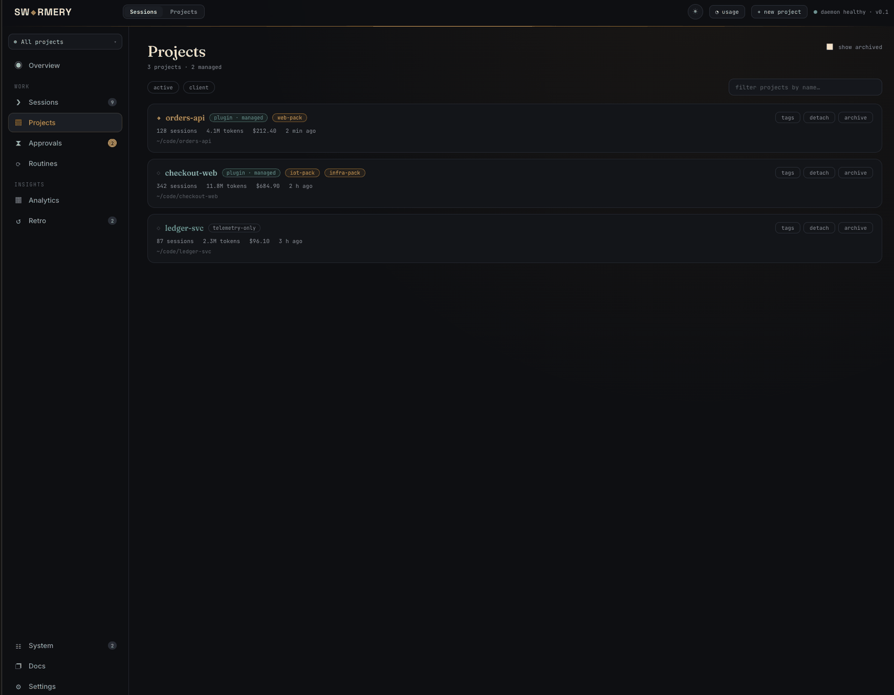</a>
  <br><sub><i>Managed vs telemetry-only, lifetime spend, and a week-over-week health table underneath.</i></sub>
</div>

---

### Project workspace · Overview

Switch to a project and the whole app re-scopes — its own board, plans, memory and terminal. The
project home opens with a hero sentence pairing what actually shipped this week against how often
the agents had to stop and ask you, which is the ratio that decides whether delegation is working.

Below it: right-now tiles (what is running, blocked, in flight, or leaking stale worktrees),
week-over-week deltas, a funnel showing where work really sits, and open insights.

The capability inventory at the bottom answers a question that is otherwise guesswork — which
agents, skills, commands and hooks this project *actually uses*, as opposed to which ones are
installed — with per-agent error rates and an autonomy badge. Telemetry-only projects hide that
section entirely rather than showing an empty shell.

<div align="center">
  <a href="docs/screenshots/project-overview.png">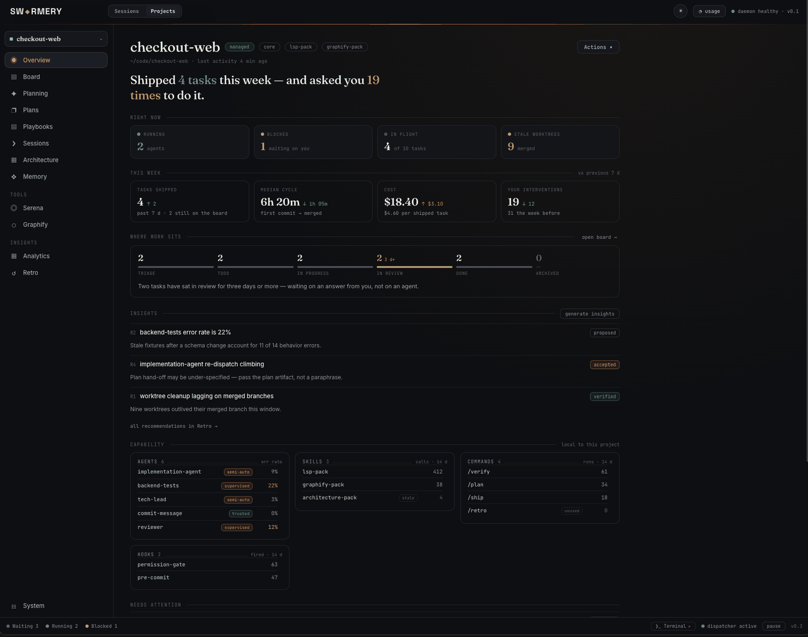</a>
  <br><sub><i>Shipped this week vs. how often you were interrupted — then what is running right now.</i></sub>
</div>

### Project workspace · Board → worktree → agent

A six-column board: Triage → Todo → In Progress → In Review → Done → Archived. Drag and drop is
native, and a column drop issues an optimistic update that reverts with a toast if the server
refuses it — but every card also carries a keyboard **move to →** menu, so dragging is never the
only path. Quick entry sits at the top of Triage, Done sorts by when it got there, and Archived
loads lazily on first expand to keep the default view light.

Moving a card into **Todo** is the part that does real work. The dispatcher wakes, acquires a
dedicated `swarm/<task-id>` git worktree so the agent can never collide with your working tree,
runs a headless `claude -p` session under that task's playbook, and hands the result to the
verifier — which grades it against the task and stamps `PASS` / `FAIL` / `INCONCLUSIVE` before
the card lands in review.

<div align="center">
  <a href="docs/screenshots/board.png">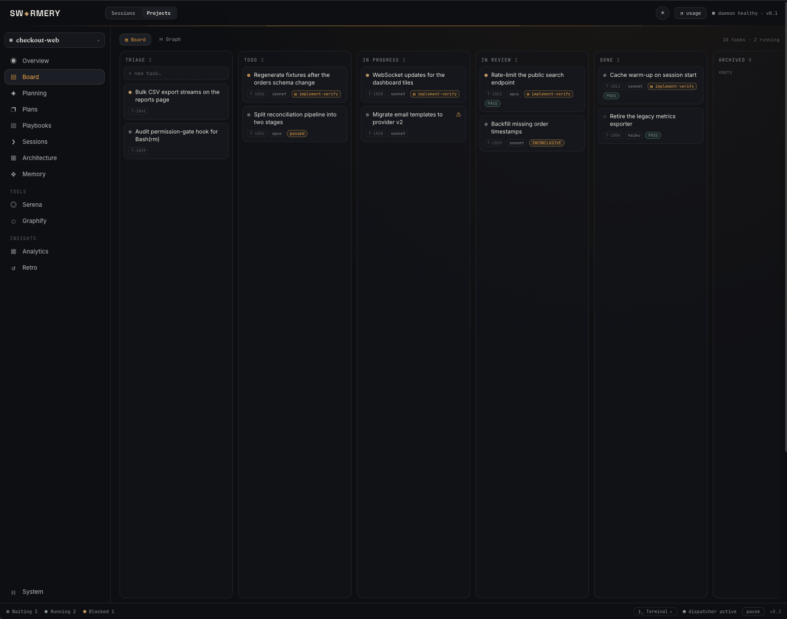</a>
  <br><sub><i>Todo is the trigger: worktree, headless agent, verification, then In Review.</i></sub>
</div>

### Project workspace · Planning Mode

Describe what you want to build, in prose. A planner session takes the idea and interviews you
through a wizard — one question at a time on the left, the plan as it currently stands sticky on
the right, where you can refine it or tell the planner to proceed. While it is thinking you get
elapsed time and its last reasoning snippet rather than an opaque spinner.

The output is a structured plan written into your private workspace, which then shows up on the
Plans page. If a planner reply ever fails to parse against the wizard protocol, the page shows the
raw prose plus a free-text box that answers through the same endpoint — a malformed reply degrades
into a conversation instead of dead-ending the session.

<div align="center">
  <a href="docs/screenshots/planning.png">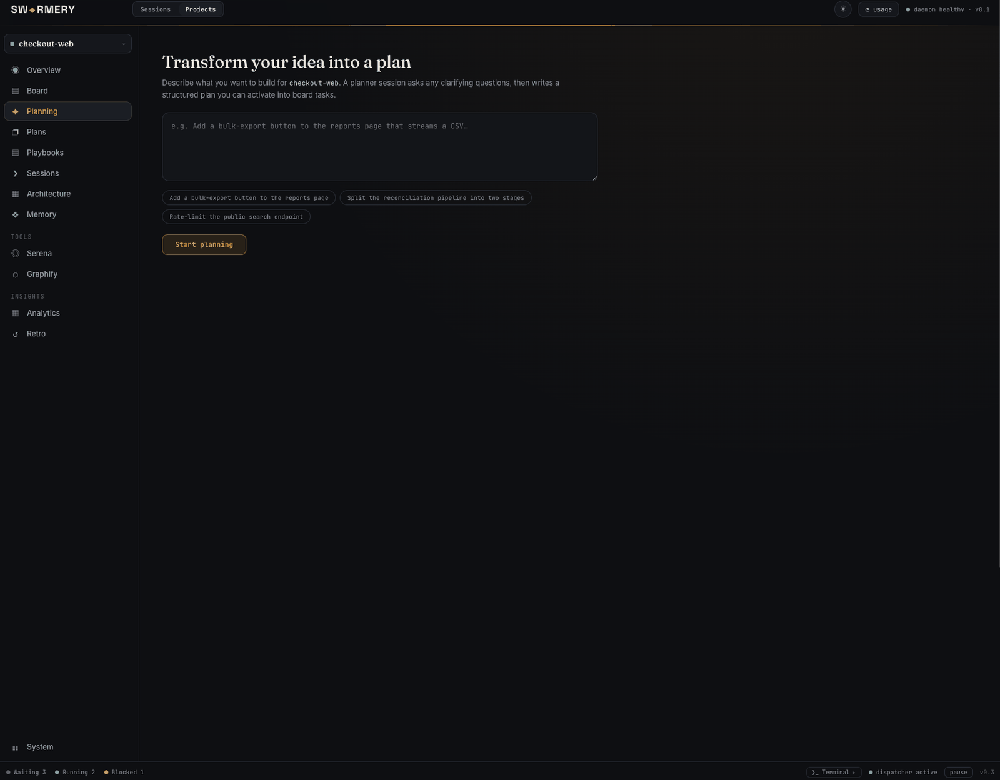</a>
  <br><sub><i>Question on the left, the plan so far on the right — refine or proceed at any point.</i></sub>
</div>

### Project workspace · Plans

A workspace plan *is* an epic. The markdown on disk stays the source of truth — this page is the
control surface over it, so the workspace folder becomes infrastructure you never have to open.

Epics filter by Active / Done / Archived and drill into a phase timeline in sequence order, with
depends-on badges between phases and per-phase progress derived from the acceptance-criteria
checkboxes in the doc itself. Lifecycle controls (pause / resume / archive / restore) are real
file operations on the daemon side, not database flags.

Both the plan and each phase open into tabbed detail — **Phase** (run state, interactive criteria,
the full doc), **Summary** (completion report, ticked criteria, execution record), **Edit** (raw
markdown). Ticking a criterion in the UI patches that exact `- [ ]` ↔ `- [x]` line in the file.

Work runs from here two ways: a single phase executes headlessly from its own doc, or the **whole
plan** goes to one agent via `Run plan` with an agent and mode picker. While a plan-level run owns
the docs, the per-phase Run buttons stand down and progress surfaces as checkboxes ticking
themselves — which is the honest signal, since that is literally what the agent is doing.

<div align="center">
  <a href="docs/screenshots/plans.png">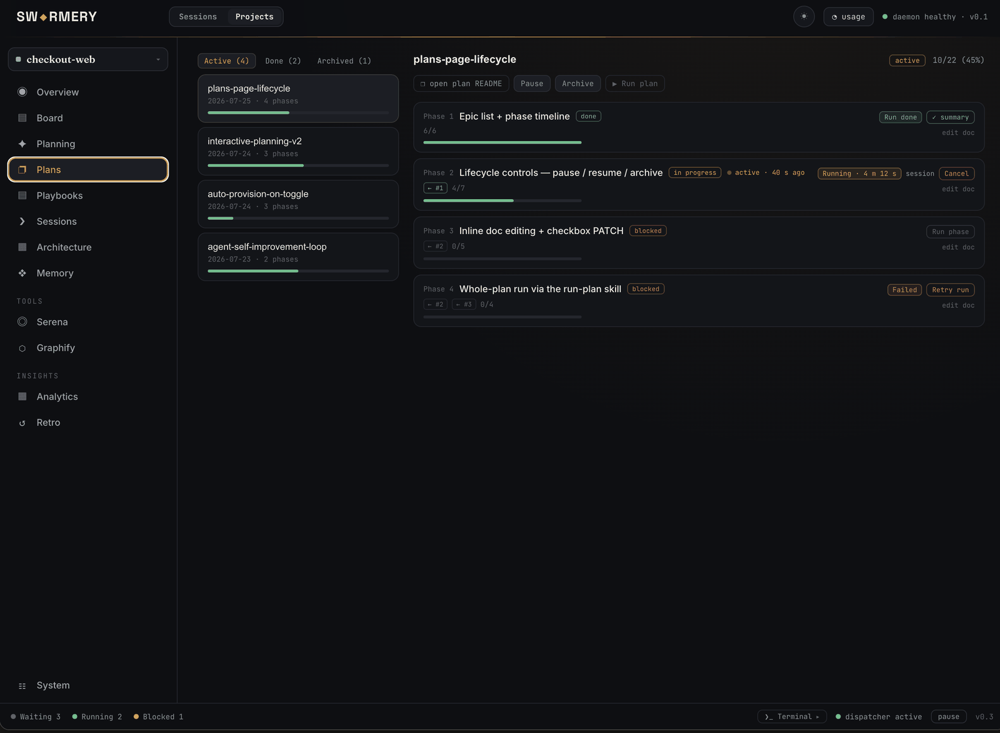</a>
  <br><sub><i>Phases in sequence with their dependencies; progress comes from real checkboxes in the markdown.</i></sub>
</div>

Each phase carries its own acceptance criteria and a self-contained agent prompt, and — once it
has been executed — a completion report plus the execution record appended to the doc.

<div align="center">
  <a href="docs/screenshots/plan-phase.png">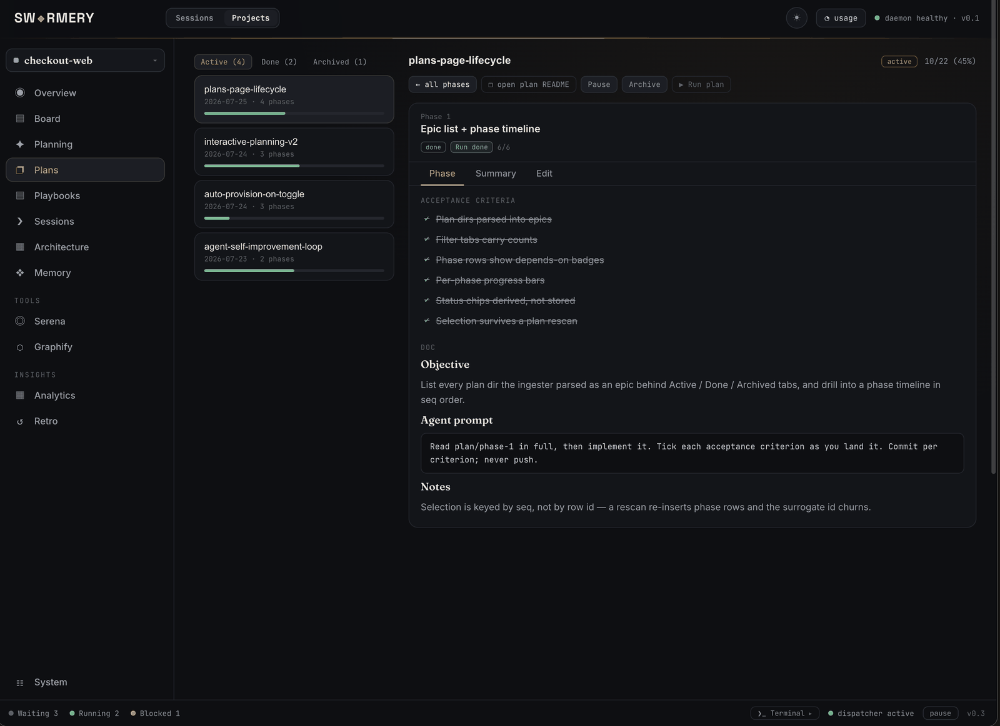</a>
  <br><sub><i>Criteria are clickable: ticking one rewrites that line in the phase document.</i></sub>
</div>

### Project workspace · Playbooks

A playbook is the recipe a dispatched task runs under, and this page makes it visible instead of
implicit. Selecting one renders its stage chain — boxes joined by arrows — showing which model
runs `plan`, `implement`, `verify` and `review`, and the exact prompt each stage receives.

Four built-ins ship with the daemon and stay read-only. **Duplicate to project** copies the
markdown into `<project>/.claude/playbooks/`, at which point the prompts are yours to edit — the
same graduation rule the marketplace uses, applied to execution recipes. (Visual authoring of the
graph is deliberately not built; you edit the file.)

<div align="center">
  <a href="docs/screenshots/playbooks.png">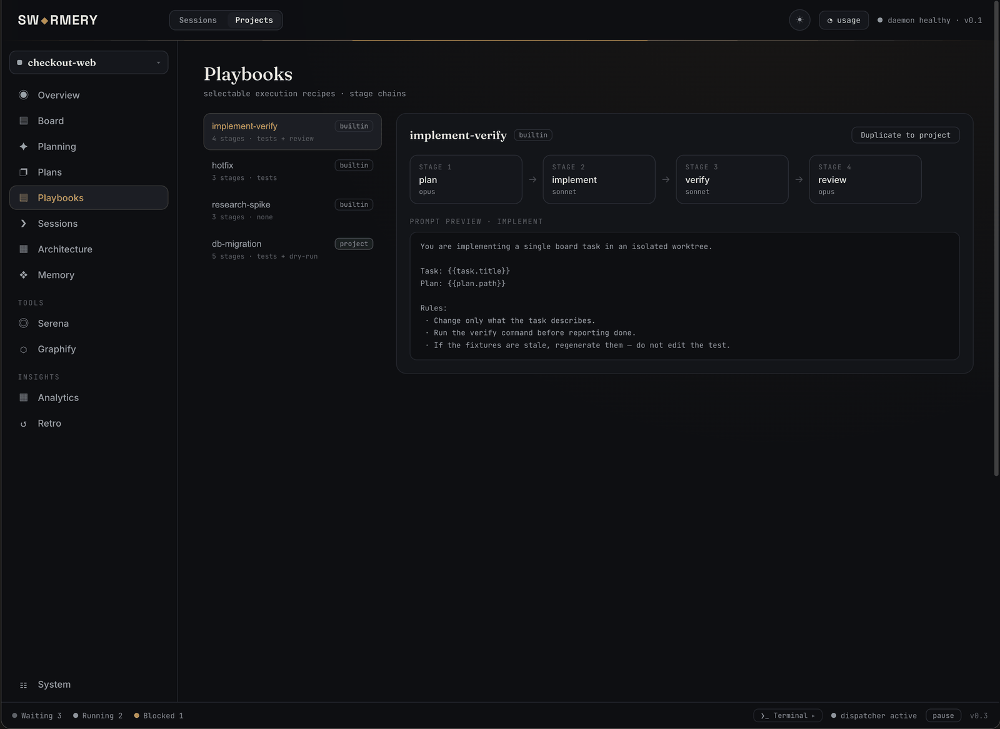</a>
  <br><sub><i>Which model runs each stage, and the literal prompt it gets — before you dispatch anything.</i></sub>
</div>

### Project workspace · Architecture

The project's architecture map (`/architecture-map` from `architecture-pack`) embedded in the
dashboard — modules by layer, named end-to-end flows, API surface — instead of living as an HTML
file you forget you generated.

A staleness badge compares the commit baked into the map against current `HEAD`, so you always
know whether you are reading the repo or a memory of it, and a rebuild runs headlessly from the
page. The project dropdown lists anything with `architecture-pack` enabled *or* an existing
artifact, so a pack-enabled project that has never generated a map still appears — and can be
built from here.

The embedded map ships its own palette and light/dark toggle, which would fight the dashboard; the
app's live design tokens are pushed into the iframe as inline custom properties, so the map
follows your theme instead of choosing its own.

<div align="center">
  <a href="docs/screenshots/architecture.png">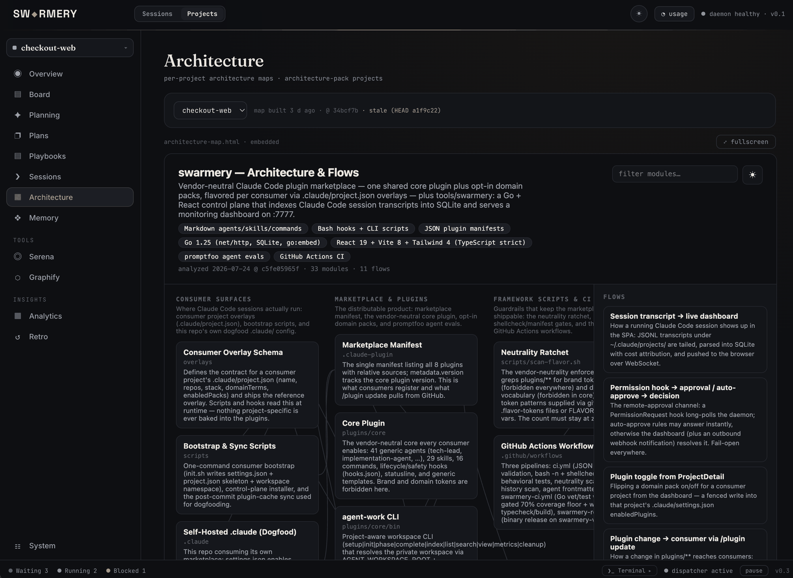</a>
  <br><sub><i>The staleness badge compares the map's commit against <code>HEAD</code> — rebuild is one click.</i></sub>
</div>

### Project workspace · Memory

Everything a project remembers, in one editor, grouped by the three roots it actually lives in:
project instructions (`CLAUDE.md`), Claude Code's auto-memory, and Serena notes.

Markdown editing with a preview toggle, and two guards that matter when a running agent may be
writing the same files: saving checks a base hash and offers a reload instead of silently
clobbering a change made underneath you, and navigating away with unsaved edits asks first. Files
the daemon reports unwritable — a Serena note, or everything when the read-only kill-switch is
on — are badged rather than failing at save time.

<div align="center">
  <a href="docs/screenshots/memory.png">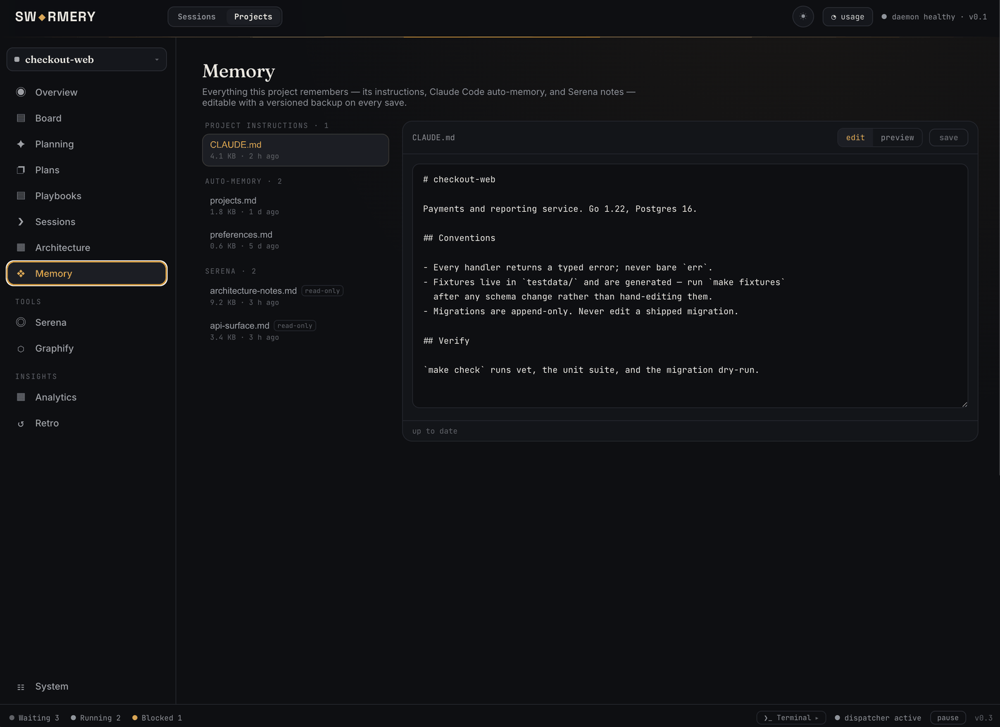</a>
  <br><sub><i>Three memory roots, one editor — with a conflict guard for files an agent may be writing.</i></sub>
</div>

### Project workspace · Terminal

Real PTYs docked under the dashboard, opened in the project root or directly in a task's worktree
— so checking what an agent actually did doesn't cost you a context switch out of the page.

Each tab is its own live shell, with font sizing, clear, fullscreen and a drag handle to resize
the dock. Open state, height and the tab list persist per project, so a browser reload restores
the workspace you left. The heavy terminal bundle is lazy-loaded — it is never fetched until you
first open a tab.

<div align="center">
  <a href="docs/screenshots/project-terminal.png">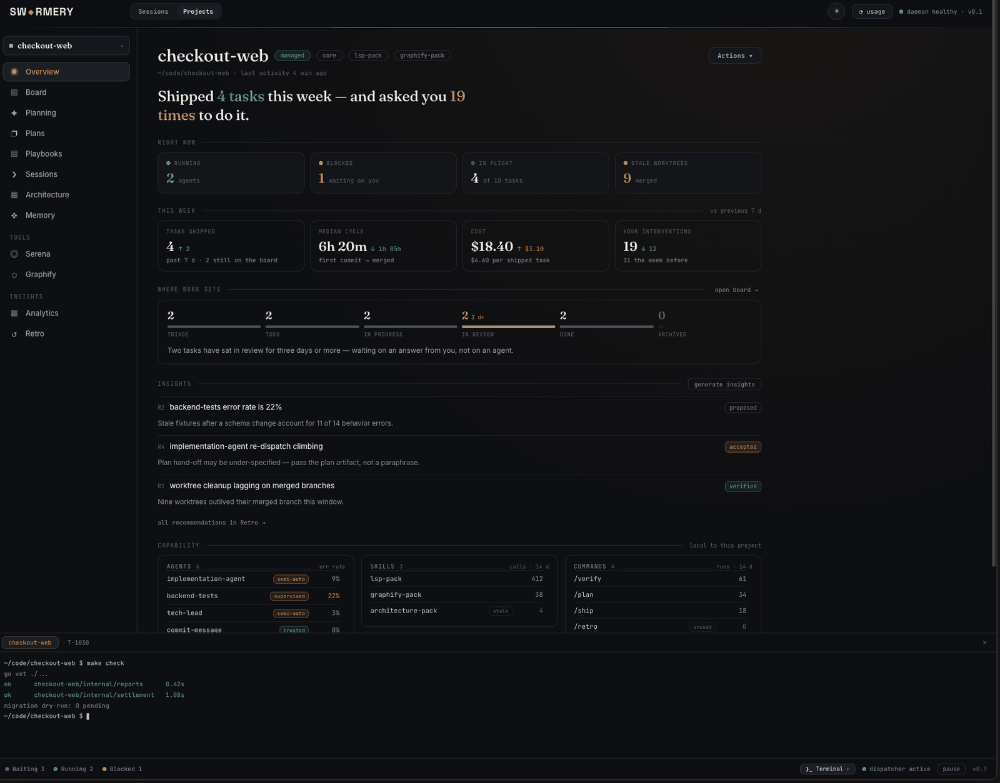</a>
  <br><sub><i>One live PTY per tab, opened in the repo root or in a task's worktree.</i></sub>
</div>

---

## How the loop closes

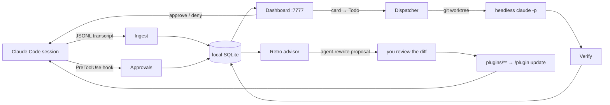
```mermaid
flowchart LR
    CC["Claude Code session"] -->|JSONL transcript| ING[Ingest]
    CC -->|PreToolUse hook| APPR[Approvals]
    ING --> DB[(local SQLite)]
    APPR --> DB
    DB --> UI["Dashboard :7777"]
    UI -->|approve / deny| CC
    UI -->|card → Todo| DISP[Dispatcher]
    DISP -->|git worktree| AGENT["headless claude -p"]
    AGENT --> VER[Verify]
    VER --> DB
    DB --> ADV[Retro advisor]
    ADV -->|agent-rewrite proposal| REVIEW["you review the diff"]
    REVIEW --> PLUGINS["plugins/** → /plugin update"]
    PLUGINS --> CC
```

Sessions produce evidence; evidence produces recommendations; recommendations become reviewed
changes to the agents themselves; the marketplace ships those changes to every project.

---

## The plugin marketplace

The other half of the repo. Copying an agent system between projects rots fast: substitutions
pile up, files drift, every improvement has to be ported N times. Swarmery replaces that with
the native Claude Code plugin mechanism — **semver-versioned**, **namespaced** (`core:tech-lead`),
**updatable** (`/plugin update`). Projects pin a known-good version and adopt on bump.

| Plugin | What's inside |
|---|---|
| **`core`** | The vendor-neutral framework every consumer enables: 41 agents (tech-lead, implementation-agent, debugger, verification-agent, security-auditor, …), 29 skills, 16 commands, lifecycle/safety hooks, the statusline, and the project-aware `agent-work` workspace CLI. |
| `uav-pack` | UAV/drone domain: MAVLink-style telemetry, mission planning, embedded/edge runtime. |
| `iot-pack` | IoT domain: BLE communication, device telemetry, health-metrics processing. |
| `web-pack` | Web/marketing: SEO, i18n, landing-page CRO, Figma-to-code styling. |
| `infra-pack` | Infrastructure & delivery: Kubernetes/Helm, GitOps promotion, IaC, GitLab CI, cloud CI auth, Keycloak. |
| `lsp-pack` | Semantic code navigation via the Serena LSP MCP server (needs the `serena` binary). |
| `claude-eng-pack` | Claude-engineering: agent architecture, tool/MCP design, prompt engineering, Claude Code config, context reliability. |
| `graphify-pack` | `/graphify` — repo → persistent knowledge graph with query/path/affected tools (needs the `graphify` CLI). |
| `architecture-pack` | `/architecture-map` — machine-readable architecture JSON + a self-contained HTML viewer, freshness-stamped per commit. |

Every pack requires `core` and is opt-in per project.

### Consuming it

One command from the project root (details in [docs/ONBOARDING.md](docs/ONBOARDING.md)):

```bash
bash <swarmery-repo>/scripts/init.sh <project-slug> [pack ...]
```

Or by hand, in the project's `.claude/settings.json`:

```jsonc
{
  "extraKnownMarketplaces": {
    "swarmery": { "source": { "source": "github", "repo": "atretyak1985/swarmery" } }
  },
  "enabledPlugins": {
    "core@swarmery": true,
    "web-pack@swarmery": true
  },
  "env": { "AGENT_PROJECT": "your-project" }
}
```

Then drop your flavor config into `.claude/project.json` (schema in `overlays/_schema/`,
reference overlay in `overlays/example/`). Core agents, skills, and hooks read it at runtime for
repos, the main app, cloud settings, and domain terms — **nothing project-specific is ever baked
into a plugin** (policy: [docs/NEUTRALITY.md](docs/NEUTRALITY.md), enforced in CI by
`scripts/scan-flavor.sh`, which must report zero hits).

### Design rules

- **Cross-project isolation.** Enabling swarmery is additive: a project's own `.claude/agents/`
  still wins by name — that's the intended override mechanism, not a fork. Work artifacts live in
  a per-project namespace (`AGENT_WORKSPACE_ROOT` + `AGENT_PROJECT`), so clients never share
  context.
- **Framework ≠ workspace.** Plans, sessions, and task dirs live in a separate private workspace
  repo, never here.
- **Graduation rule** ([docs/EXTENDING.md](docs/EXTENDING.md)): components are born
  project-local, promoted to a domain pack when a second project needs them, then to `core` when
  every project does. **Flow goes up only.**
- **Explicit semver** in every `plugin.json`; a change pushed without a bump is a change no
  consumer will ever pull.

---

## Configuration

<details>
<summary><b>CLI reference</b></summary>

| Command | Purpose |
|---|---|
| `serve` | Run the daemon + dashboard on `:7777`. |
| `onboard` / `offboard` / `attach` | Bring a directory under swarmery (writes `.claude/`), or reverse it. |
| `hooks install\|uninstall\|status` | Install the permission/stop hook shim into Claude Code settings. |
| `hook <permission-request\|stop>` | The shim itself — invoked by Claude Code, always exits 0. |
| `console` | Interactive TUI: live event feed, y/n approvals, dispatcher pause. |
| `status` / `service-status` | Live daemon snapshot / launchd service state. |
| `install` / `uninstall` | Register or remove the launchd auto-start service (macOS). |
| `ingest` / `backfill` / `wscan` / `sysscan` | One-shot index passes (transcripts, workspace, machine config). |
| `backup` / `prune` / `recost` | Snapshot the DB (safe while serving), roll up + delete old rows, re-price sessions. |

</details>

<details>
<summary><b>Environment variables</b></summary>

| Variable | Default | Effect |
|---|---|---|
| `SWARMERY_PORT` | `7777` | Listen port. |
| `SWARMERY_PROJECTS_ROOTS` | `~/.claude/projects` | Comma-separated transcript roots — one per Claude Code config dir, for machines running several subscriptions via `CLAUDE_CONFIG_DIR`. `auto` = every `~/.claude*/projects` that exists. A root that is missing on this machine is logged and skipped. Each session is stamped with the account its root names (`~/.claude-nabu-org` → `nabu-org`, plain `~/.claude` → the default), so the sessions list can filter by subscription and `GET /api/stats/breakdown?by=account` splits cost per plan. |
| `SWARMERY_PROJECTS_ROOT` | *(unset)* | Legacy singular form of the above; honored as a one-element list. |
| `SWARMERY_WORKSPACE_ROOT` | `~/swarmery-workspace` | Private workspace repo root (plans, tasks). |
| `SWARMERY_EXCLUDE` | `/tmp/*,/private/tmp/*` | Comma-separated project paths to ignore. |
| `SWARMERY_ONBOARD_ROOTS` | *(empty — disabled)* | Allow-list of parents the dashboard may onboard under. |
| `SWARMERY_SETTINGS_OVERLAYS` | `~/.swarmery/overlays.json` | Path to a descriptor of settings files that also apply to given project roots — for projects whose plugin set is injected at CLI precedence (`claude --settings <file>`) instead of being committed to the repo. See [Settings overlays](#settings-overlays) below. A missing or malformed file silently degrades to repo-only detection. |
| `SWARMERY_SYSTEM_READONLY` | `0` | `1` refuses **all** config and memory writes — safe for shared machines. |
| `SWARMERY_DISPATCH` | on | `0`/`false`/`off` disables the board→agent dispatcher. |
| `SWARMERY_AUTOVERIFY` / `SWARMERY_ROUTINES` / `SWARMERY_AUTOPROVISION` | on | Kill-switches for verification, routines, pack auto-provisioning. |
| `SWARMERY_MAX_CONCURRENT` / `SWARMERY_MAX_WORKTREES` | `2` / `4` | Dispatcher concurrency and worktree ceiling. |
| `SWARMERY_DISPATCH_TIMEOUT_MIN` | `45` | Hard timeout per dispatched agent run. |
| `SWARMERY_NOTIFY_URL` / `_EVENTS` / `_TELEGRAM_CHAT` | — | Outbound webhook notifications (e.g. when an approval is waiting). |
| `SWARMERY_CLAUDE_BIN` | `claude` | Path to the Claude Code CLI the daemon spawns. |

`swarmery install` bakes any `SWARMERY_*` you have exported into the launchd plist.
Flags mirror most of these (`--port`, `--bind`, `--exclude-projects`, `--workspace-root`, …);
run `swarmery help` for the full list.

<a id="settings-overlays"></a>
**Settings overlays.** swarmery normally decides whether a project is *managed*
(and which packs it runs) from that project's own `.claude/settings.json`. If you
start Claude Code through a launcher that injects a settings file at CLI
precedence — `claude --settings <file>` — and deliberately keep `enabledPlugins`
out of the repo, the daemon would report `managed: false` for a project running
the full plugin set in every session.

Declare the extra settings file and the roots it applies to, and the dashboard
merges it on top of the repo's own settings (the overlay wins on a key conflict,
matching real session precedence):

```jsonc
// ~/.swarmery/overlays.json
{
  "overlays": [
    {
      "name": "acme",                                    // label echoed as provenance
      "settingsPath": "~/launcher/orgs/acme/settings.json",
      "roots": ["~/work/acme"]                           // this project and everything under it
    }
  ]
}
```

`~` expands to your home directory. The affected API responses gain an
`overlaySources` field naming the overlays that contributed, so a `managed: true`
is always traceable to where it came from. Plugin **drift** detection stays
repo-scoped on purpose (its repair writes the repo's `settings.json`), so a
plugin enabled only by an overlay reports status `unknown` rather than a green
`ok` — nothing checked it.

</details>

---

## Scope and limits

Stated plainly, so nothing here surprises you later:

- **Single-user, localhost-only.** The daemon binds `127.0.0.1`; mutating endpoints are guarded
  by a local-origin check. There is no authentication and no multi-user model — don't expose it.
- **Agent-level cost is not attributed.** Claude Code's transcripts don't record sub-agent
  turns, so agents and skills carry **run counts**, not dollars. Session- and project-level cost
  is exact.
- **Planning runs are in-memory.** A daemon restart forgets an in-flight planning session
  (the written plan survives — it's a file).
- **Playbooks are read + duplicate.** Visual authoring isn't built; edit the copied file.
- **Graphify artifacts are served, not built.** The daemon embeds an existing `graph.html`;
  generating it is the `graphify` CLI's job.
- **Auto-provisioning generates for `architecture-pack` only.** Other packs are install-only.
- **macOS is the first-class host.** The daemon is portable Go, but `install` /
  `service-status` are launchd-specific.

---

## Working on swarmery itself

```bash
cd tools/swarmery
make build          # snapshot docs → vite bundle → go:embed → single ./swarmery binary
make test           # go vet ./... && go test ./...
make dev            # go daemon + vite dev server (proxies /api to :7777)
make install        # rebuild + swap the launchd-managed binary (macOS)
```

Marketplace-side checks (mirrors [`ci.yml`](.github/workflows/ci.yml)):

```bash
find plugins scripts -name '*.sh' -exec bash -n {} \;      # shell syntax
bash scripts/tests/protect-sensitive-files.test.sh          # hook behaviour
bash scripts/scan-flavor.sh                                 # neutrality ratchet — must be "✓ clean"
```

Installed plugins run from `~/.claude/plugins/cache`, **not** from your checkout — test
in-progress plugin changes with `claude --plugin-dir plugins/core` (repeatable per pack).

Further reading: [docs/ONBOARDING.md](docs/ONBOARDING.md) ·
[docs/PLUGINS.md](docs/PLUGINS.md) · [docs/EXTENDING.md](docs/EXTENDING.md) ·
[docs/NEUTRALITY.md](docs/NEUTRALITY.md) · [docs/WORKFLOW.md](docs/WORKFLOW.md) ·
[control plane README](tools/swarmery/README.md) · [SECURITY.md](SECURITY.md)

---

## License

[PolyForm Noncommercial 1.0.0](LICENSE) — free for personal, educational, and open-source use;
commercial use prohibited.
