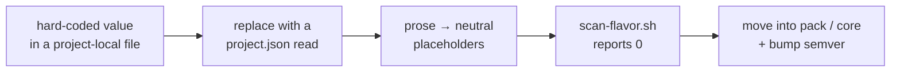

# Vendor neutrality policy

`plugins/**` must contain **zero** project-specific tokens — no company/product names, no internal
repo names, no environment aliases, no cloud regions. Per-project flavor lives in each consumer's
`.claude/project.json` (schema: `overlays/_schema/project.schema.json`; sample: `overlays/example/`)
and is read at **runtime** by core agents, skills, and hooks.

## Rules

- **Brand tokens** (project/company identity, internal infra names) — forbidden everywhere in `plugins/**`.
- **Domain vocabulary** (e.g. drones for `uav-pack`, wearables for `iot-pack`) — legitimate *inside its
  own domain pack*, forbidden in `core`.
- Scripts/hooks read `${CLAUDE_PROJECT_DIR}/.claude/project.json`; never default to a hard-coded path.
- Prose examples use neutral placeholders (`apps/<mainApp>`, `<device>`, `<envAlias>`) or neutral
  example domains (`orders/line-items`, `pipelines/job_runs`).
- Frontmatter identity is `swarmery-core`.

De-flavoring is what a component goes through on its way up, and it is mechanical:



## Checking

`scripts/scan-flavor.sh` greps `plugins/**` for your token patterns:

```bash
# Put your (private) token regexes next to the repo or in the env:
echo 'mycompany|my-app|my-env-alias' > .flavor-tokens          # brand family (gitignored)
echo 'my-domain-noun' > .flavor-tokens-domain                  # domain family (gitignored)
bash scripts/scan-flavor.sh                                    # target: 0 occurrences
```

Without those files the script falls back to a small example pattern — replace it with your own.

> [!IMPORTANT]
> Run this as a CI ratchet: the count must never increase. A neutrality regression is
> cheap to fix the day it lands and expensive once a second consumer has adopted it.
